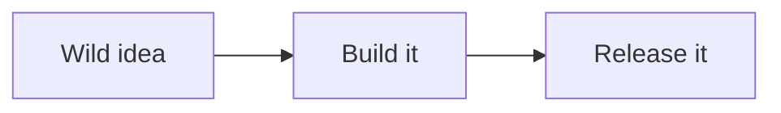

---
aliases:
  - Neon Acid Demo
tags:
  - neon-acid
  - theme-demo
cssclasses:
  - neon-acid-showcase
---

# Neon Acid Theme Showcase

This note is a visual stress test for **Neon Acid**. Open it in both *Reading view* and *Live Preview*, hover over the interactive pieces, and compare the theme at narrow and wide window sizes.

> [!tip] Demo tip
> Turn off **Settings → Appearance → Reduce motion** if you want to see every animation. Your operating system’s reduced-motion preference may also disable motion.

## Typography & Headings

The theme gives level-one headings electric-lime text and a hot-pink underline. Level-two headings become hot-pink blocks with lime shadows, while level-three headings become cyan blocks with purple shadows.

### Level Three: Cyan + Purple

#### Level Four: Browser Default

##### Level Five: Browser Default

###### Level Six: Browser Default

Regular body copy uses the theme’s sans-serif stack. Here is **bold text**, *italic text*, ***bold italic text***, ~~strikethrough~~, ==highlighted text==, H~2~O-style subscript text, and an inline `const neon = true;` code sample.

Use a horizontal rule to test spacing:

---

## Links, Wiki Links & Tags

This is an [external link to Obsidian](https://obsidian.md), this is a [[Neon Acid Theme Showcase|wiki link back to this note]], and this is an unresolved [[Imaginary Neon Note]]. Hover over each link to see the pink reversal.

#neon-acid #theme-demo #electric-lime #hot-pink

## Lists & Checkboxes

- Unordered list item
- A second item with **bold emphasis**
  - Nested item
  - Another nested item with `inline code`
- Final item

1. Ordered list item
2. Another ordered item
   1. Nested ordered item
   2. Second nested item
3. Final ordered item

- [x] Completed task
- [ ] Open task
- [x] A completed item with a [link](https://obsidian.md)
- [ ] A nested checklist
  - [x] Nested complete
  - [ ] Nested open

## Blockquotes & Standard Callouts

> This is a standard blockquote. It uses the theme’s dark panel, heavy black border, and cyan hard shadow.
>
> It can contain **bold text**, *emphasis*, `inline code`, and [links](https://obsidian.md).

> [!note] Standard Note Callout
> Standard Obsidian callouts receive the shared dark neo-brutalist panel treatment.

> [!warning] Standard Warning Callout
> This checks how Obsidian’s native callout color and icon interact with the theme.

> [!example]- Folded Callout
> Click the title to unfold this content and test the collapsed state.

## Illustrated Acid Callouts

These four custom callout types activate the illustrations embedded directly in `theme.css`. Their normal callout titles and icons are deliberately hidden.

> [!acid-thought] Acid Thought
> An idea can start quietly and still become impossible to ignore. This callout uses a pale blue background, strong blue border, decorative quote mark, and animated illustration.

> [!acid-quote] Acid Quote
> “The web should feel alive, personal, remixable, and a little bit strange.” This cyan callout’s illustration uses the wiggle animation.

> [!acid-soap] Acid Soap
> A clean little space for a confession, rant, announcement, or dramatic aside. This callout exercises the soap illustration declared by the theme.

> [!acid-heart] Acid Heart
> Made with unreasonable enthusiasm, hot-pink energy, and a stubborn affection for software that feels human.

## Tables

| Feature | Theme treatment | Status | Link |
|:--|:--|:--:|--:|
| Header | Purple, uppercase, heavy weight | **LOUD** | [Docs](https://help.obsidian.md) |
| Odd row | Deep violet-black cell background | Ready | 01 |
| Even row | Zebra-striped background | **ACTIVE** | 02 |
| Hover | Row shifts to a brighter navy-violet | Try me | 03 |
| Long content | Cells wrap naturally while the table retains its hard border and cyan shadow | **PASS** | 04 |

## Code

Inline code looks compact and framed: `npm run build`, `#39ff14`, and `theme-dark`.

The HTML sample exercises tags, punctuation, attributes, attribute values, and comments:

```html
<!-- Neon Acid syntax test -->
<article class="neon-card" data-active="true">
  <h2 id="signal">Hello, weird web.</h2>
  <a href="https://example.com">Follow the signal</a>
</article>
```

The JavaScript sample exercises comments, keywords, strings, numbers, functions, properties, operators, and booleans:

```javascript
// Every token should stay legible against the black block.
const palette = {
  pink: "#ff2bd6",
  green: "#39ff14",
  cyan: "#00e5ff",
  intensity: 100,
  active: true,
};

function amplifySignal(value) {
  return value * palette.intensity;
}

console.log(amplifySignal(7));
```

The CSS sample checks another syntax grammar:

```css
/* Hard edges, no tasteful restraint. */
.neon-card:hover {
  color: #39ff14;
  background: #ff2bd6;
  transform: translate(-2px, -2px);
}
```

Hover a fenced block to test its movement and larger purple shadow. Use the copy button, select some code, and—if your setup supports them—enable code-block line numbers.

## Content Images

Normal Markdown images get a hot-pink frame, black hard shadow, and subtle hover movement:


An Obsidian attachment embed triggers the same treatment once you replace the filename below with an image that exists in your vault:

![[replace-with-an-image-from-your-vault.png]]

Tiny images at the theme’s exempt sizes should remain unframed. This HTML image uses an exempt width of 32 pixels:


And this one uses an exempt height of 48 pixels:


## Obsidian Extras

Here is a footnote reference.[^1]

[^1]: Footnotes are included as a general Markdown compatibility check, although `theme.css` does not target them directly.

Here is a Mermaid block for compatibility testing. It receives the general code-block frame while Obsidian renders it:



## UI-Only Theme Features

The remaining selectors in `theme.css` style Obsidian itself rather than note syntax, so simply opening this file also helps expose them:

- dark workspace, editor, sidebars, title bar, ribbon, and status bar
- boxed file and folder rows, with a hot-pink active file
- an animated illustration before rendered H1 headings and the vault root folder
- an animated marker on the active workspace tab
- an animated illustration in the graph-view header
- dark settings panels with lime headings
- reduced-motion fallbacks for images, code blocks, icons, and illustrated callouts

## End of Demo

If this final section still looks crisp after everything above, the theme survived the stress test. #ship-it
