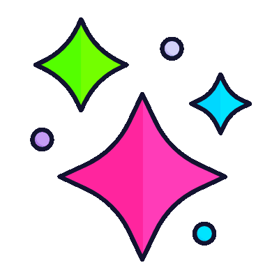
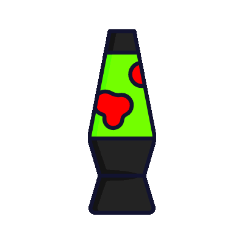
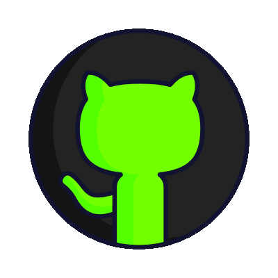
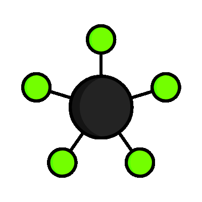
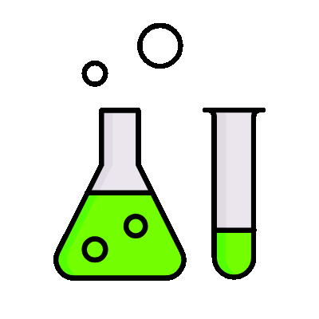

<h1 align="center">NEON ACID</h1>

  <strong>Will hurt your eyes in the best possible way.</strong>

##  PURE IRIDESCENCE

##  DESIGN PHILOSOPHY

##  CONTRIBUTE

##  BUILT FOR OBSIDIAN

  
  
  
  

A bold neo-brutalist Obsidian theme inspired by neon colors, chunky borders, playful interactions, and high contrast.

Neon Acid transforms Obsidian into a vibrant neo-brutalist workspace filled with chunky borders, vivid neon accents, playful hover animations, and an interface designed to make every interaction feel tactile.

## Features

- 🌈 Bright neon accent colors
- 🧱 Neo-brutalist styling
- ✨ Animated hover effects
- 🖼️ Framed images
- ✅ Interactive task lists
- 📝 Enhanced metadata styling
- 💻 Improved code blocks
- 📋 Polished tables and callouts
- 🎯 High-contrast interface
- ⚡ Lightweight CSS only
- Zero apologies

## Color Palette

- 💚 Neon Green #39ff14
- 💗 Neon Pink #ff2bd6
- 💙 Cyan #00e5ff
- ⚫ Black
- ⚪ White

## MAIN VAULT VIEW

## RELATED TOPICS LIST

## EDITOR VS READING VIEW

## HEADINGS

## SECTIONS

## CHECKLISTS & TABLES

**Warning:** Neon Acid contains approximately **700%** more neon than is considered medically advisable.

## TRADEOFFS:

- Your cursor becomes **nearly** invisible (but, really...will you even miss it??)
- **UNAPOLOGETIC ABUSE OF ALL CAPS!**
- Risk of **unintended style conflicts** is estimated to be around 300%

## PHILOSOPHY

A (now dead) white man known for doing philosophy (and for being a bit 'emo') once uttered: 

Until now, no one could be sure of exactly what this man had been speaking of... It was definitely Neon Acid.

## Neon Acid is...

- A highlighter.

- A glowstick.

- A bright orange transparent backpack straight out of 1994.

- A college kid high on ecstasy at a fucking rave.

- Pure iridescence.

- RADIOACTIVE

- Borders thick enough to survive re-entry.

- Hover effects with absolutely no indoor voice.

- Colors so bright you could swear they give off a low humming noise if you listen closely.

## Design Inspiration

**Neon Acid was inspired by:**

- ☢️ Radioactive waste
- 🧪 Chemistry sets
- 🌈 Glow sticks
- 🔦 Blacklights
- 💿 1990s transparent plastic
- 🟩 Highlighters
- ✨ Iridescence
- 🌋 Lava lamps
- 🛼 Roller rinks
- 🎮 Late-night arcades
